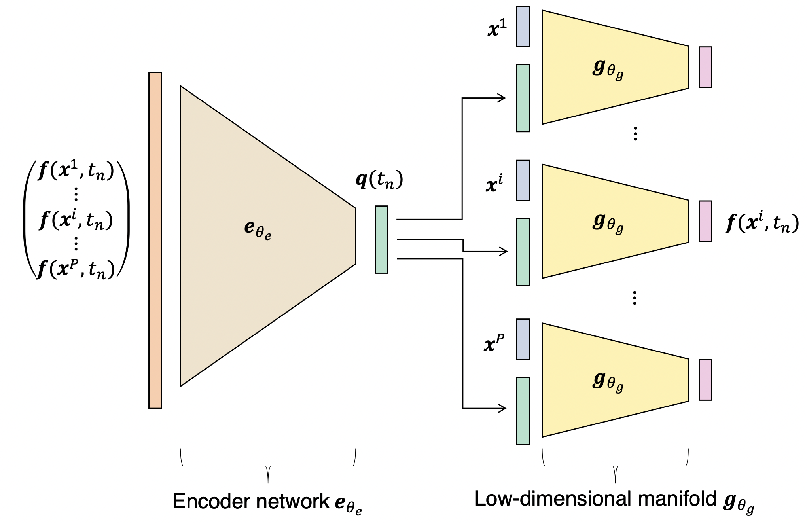

# CROM: Continuous Reduced-Order Modeling of PDEs Using Implicit Neural Representations (Part I - Manifold Construction)

<p align="center">

</p>

This repository is part I of the official implementation of the paper:

> **[CROM: Continuous Reduced-Order Modeling of PDEs Using Implicit Neural Representations](https://arxiv.org/abs/2206.02607)**  
> [Peter Yichen Chen](https://peterchencyc.com), [Jinxu Xiang](https://www.linkedin.com/in/jinxu-xiang-0862631a2), [Dong Heon Cho](https://www.linkedin.com/in/david-cho-003285131), [Yue Chang](https://changy1506.github.io), [Dong Heon Cho](https://www.linkedin.com/in/david-cho-003285131), G A Pershing, [Henrique Teles Maia](https://henriquetmaia.github.io), [Maurizio M. Chiaramonte](https://www.linkedin.com/in/maurizio-chiaramonte-03779762), [Kevin Carlberg](https://kevintcarlberg.net), [Eitan Grinspun](https://www.dgp.toronto.edu/~eitan/)  
> Columbia University, Meta Reality Labs Research, MIT CSAIL, University of Toronto

See the project page for more details (including videos): https://crom-pde.github.io

Part I focuses on Section 3 of the paper, Manifold Construction / offline training stage. After training, we solve PDEs by time-integrating the dynamics of the manifold's latent space vector (Section 4 of the paper). These latent space dynamics codes are listed in [Part II](https://github.com/peterchencyc/CROM_online_deployment).


## Prerequisites
We assume a fresh install of Ubuntu 20.04. For example,

```
docker run --gpus all --shm-size 128G -it --rm -v $HOME:/home/ubuntu ubuntu:20.04
```

Install python and pip:
```
apt-get update
apt install python3-pip
```

## Dependencies
Install python package dependencies through pip:

```
pip install -r requirements.txt
```

## Usage

### Training

```python
python3 run.py -mode train -d [data directory] -initial_lr [learning rate constant] -epo [epoch sequence] -lr [learning rate scaling sequence] -batch_size [batch size] -lbl [label length] -scale_mlp [network width scale] -ks [kernel size] -strides [stride size] [-siren_dec] [-dec_omega_0 [decoder siren omega]] [-siren_enc] [-enc_omega_0 [encoder siren omega]] 
```

For example 

```python
python3 run.py -mode train -d /home/ubuntu/sim_data/libTorchFem_data/extreme_pig/test_tension011_pig_long_l-0.01_p2d -lbl 6 -lr 10 5 2 1 0.5 0.2 -epo 3000 3000 3000 3000 3000 1000 -batch_size 16 -scale_mlp 20 --gpus 1
```
Sample data can be downloaded from here: https://www.dropbox.com/sh/c71axdcpxng2nu3/AABp0YZ6ho__Ih3P2cmjMC2Ga?dl=0

### Reconstructing Simulation

```python
python3 run.py -mode reconstruct -m [path to .ckpt file to use]
```

You may also provide any built-in flags for PytorchLightning's [Trainer](https://pytorch-lightning.readthedocs.io/en/stable/common/trainer.html#trainer-flags)

### Data 
Simulation data should be stored in a directory with the following structure. 
For example, 
```
├───sim_data_parent_directory (contain multiple simulation sequences; each entry in this directory is a simulation sequence)
    ├───sim_seq_ + suffix
        ├───h5_f_0000000000.h5
        ├───h5_f_0000000001.h5
        ├───...
        
    ├───....
```
See SimulationState under SimulationDataset.py for the structure of the h5 file.
